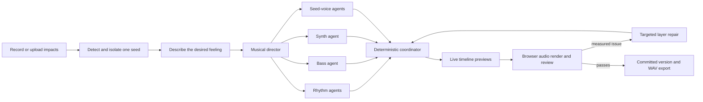

# SoundSeed

**Turn one ordinary sound into a visible, editable piece of music.**

SoundSeed is a working proof of concept inspired by live sampling: record a few messy taps, choose one isolated hit, then describe the music you want in everyday language. The studio derives the drums, bass, synths, hooks, and textures from that single sonic seed and shows how the arrangement develops across a timeline.

The goal is not to hide the transformation behind a “generate song” button. SoundSeed makes the process observable: detected impacts, isolated source, pitched note paths, agent activity, arrangement sections, per-layer events, rendered-audio checks, and every revision remain visible in the interface.

## What it can do

- Record up to 10 seconds from the microphone, upload an audio clip, or use the built-in irregular-impact demo.
- Detect separate impacts in an uneven recording and let the listener choose the cleanest hit.
- Estimate the seed's pitch when possible; choose a musical key when the hit is effectively unpitched.
- Accept vague, conversational directions instead of requiring music-production terminology.
- Create or revise kicks, claps, hi-hats, bass, synths, and pitched seed voices.
- Derive every audible layer from the isolated seed through pitch shifting, filtering, transient shaping, speed changes, envelopes, and seed-based resynthesis.
- Stream each agent's progress and add provisional layers to the visible timeline as they finish.
- Preserve liked musical ideas while revising only the parts affected by a new request.
- Render the result in the browser, measure balance and repetition, and reopen only problem layers for an optional repair pass.
- Solo layers, play the complete arrangement, restore the previous version, and export the final loop as WAV.

No stock drum kit or external sample library is used. The unchanged source hit can appear as a sparse accent, but it does not need to repeat constantly; the other instruments inherit its sonic character without sounding like the same click on every beat.

## Typical workflow

1. Record a bottle tap, pen click, mug hit, or any other short sound several times.
2. SoundSeed separates the impacts and selects a strong candidate.
3. Audition the candidates and choose the seed you like.
4. Describe a first version in plain language.
5. Watch the director and layer agents build the timeline.
6. Listen, then keep chatting to reshape the same arrangement.
7. Export the version you like as a WAV file.

Example first prompt:

> Make it feel like a quiet late-night drive. Start simple, bring in a deep pulse, and let a small glassy melody appear later. Keep it warm and spacious.

Example follow-up prompts:

> The beginning is good. Make the middle feel more alive, but keep the little melody.

> It feels too busy now. Give everything more room and make the ending softer.

> Make the low end hit a little harder, then add one surprising moment before it finishes.

The listener never has to specify tracks, MIDI notes, pitch intervals, or exact bar positions. The musical director translates the description into those decisions.

## How the multi-agent studio works



The orchestration has three distinct responsibilities:

1. **Director** — converts natural language into a shared contract: tempo, key, mode, sections, progression, energy, selected layers, rhythmic lanes, relationships, and musical locks.
2. **Layer specialists** — compose their assigned note events independently and in parallel. Each response must declare isolated-seed provenance and one allowed seed transformation.
3. **Coordinator** — deterministically validates the arrangement, clamps events to the timeline, quantizes pitches, preserves locked ideas, keeps useful kick/bass reinforcement, smooths pad movement, and moves conflicting foreground events into nearby rests.

After coordination, the browser renders both the full mix and relevant layer stems. It measures peak level, low/high-frequency balance, repetition, and dynamic range. If a problem is detected, only the implicated specialists are reopened; unaffected layers remain unchanged.

## Local setup

### Prerequisites

- Node.js `>=22.13.0`
- npm
- An OpenAI API key with access to the configured Responses API model
- A modern browser with Web Audio API and `MediaRecorder` support

### Install and run

```bash
git clone https://github.com/Nishantgoyal918/soundseed-ai-studio.git
cd soundseed-ai-studio
npm install
```

Create a local environment file from the included template.

PowerShell:

```powershell
Copy-Item .env.example .env.local
```

macOS or Linux:

```bash
cp .env.example .env.local
```

Set the key in `.env.local`:

```dotenv
OPENAI_API_KEY=your_openai_api_key
```

Start the development server:

```bash
npm run dev
```

Open [http://localhost:3000](http://localhost:3000), allow microphone access when prompted, and record a few short impacts. Uploading a clip or using the demo works when microphone access is unavailable.

The API key stays on the server. Environment files are ignored by Git and must never be committed or placed in client-side variables.

## Useful commands

```bash
npm run dev        # Start the local development server
npm run lint       # Run ESLint
npm run test:unit  # Test coordination, locks, collisions, and repairs
npm test           # Unit tests + production build + rendered app contracts
npm run build      # Create the production vinext build
npm run start      # Serve a completed production build
```

## Project structure

```text
app/
├── BeatFoundry.tsx              # Studio UI, recording, analysis, audio engine, review, export
├── api/arrange/stream/route.ts  # Streaming director and parallel layer-agent orchestration
├── api/arrange/route.ts         # Non-streaming arrangement endpoint
├── globals.css                  # Complete responsive studio styling
├── layout.tsx                   # Site metadata and social preview configuration
└── page.tsx                     # Main route

lib/soundseed/
├── coordinator.ts               # Deterministic merge, normalization, locks, repairs
├── openai.ts                    # Structured Responses API client
├── schemas.ts                   # Strict director and layer response schemas
└── types.ts                     # Shared arrangement and orchestration types

tests/
├── unit/multi-agent-coordinator.test.mjs
└── rendered-html.test.mjs
```

## Audio and data flow

- Recording, decoding, hit detection, seed isolation, playback, mix rendering, stem rendering, review measurements, and WAV encoding happen in the browser.
- The arrangement API receives the listener's prompt, compact seed metadata, recent conversation, the current arrangement, and numeric audio-review measurements.
- Raw recorded audio is not sent to the OpenAI API by the current implementation.
- Model responses use strict JSON schemas. The coordinator still normalizes all musical events before the browser applies them.
- Server-Sent Events carry public progress summaries and provisional plans; private model reasoning is neither requested nor exposed.

## API-call behavior

For a new version, SoundSeed normally makes one director request followed by one request for each layer that needs composing or revising. Layer requests run in parallel. Preserved layers do not require a new specialist call.

If the rendered-audio check finds a measurable issue, a targeted repair pass can make additional calls only for the affected layers. The final coordinator is deterministic and does not require another model call.

## Current POC boundaries

- Arrangement state and version history live in the current browser session and are not persisted after a refresh.
- Arrangements are intentionally compact and currently normalized to a maximum of 16 bars.
- Planning requires an internet connection and may take longer when several layer agents or a repair pass are needed.
- The rendered-audio review is a signal-analysis heuristic, not a human mastering engineer.
- Sound quality still depends on the captured seed. Short, distinct impacts with limited room noise produce the clearest transformations.
- This is an exploratory music studio, not a replacement for a full digital audio workstation.

## Technology

- React 19 and TypeScript
- vinext and Vite
- Cloudflare Worker-compatible server output
- Web Audio API and OfflineAudioContext
- OpenAI Responses API with structured outputs
- Server-Sent Events for incremental orchestration updates

## Design principle

SoundSeed follows one non-negotiable rule:

> Every layer may transform the isolated seed, but no layer may replace it with an unrelated sound.

That constraint is what makes the result understandable. The listener can watch one small sound become rhythm, harmony, bass, and melody instead of receiving an unexplained song from a black box.
